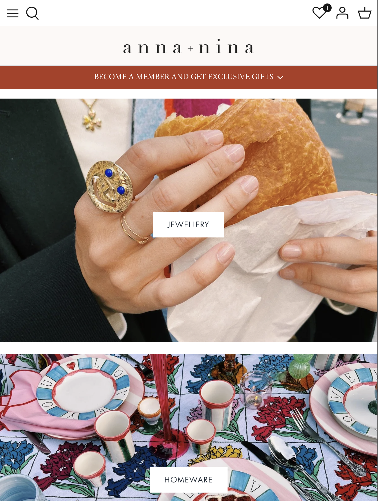
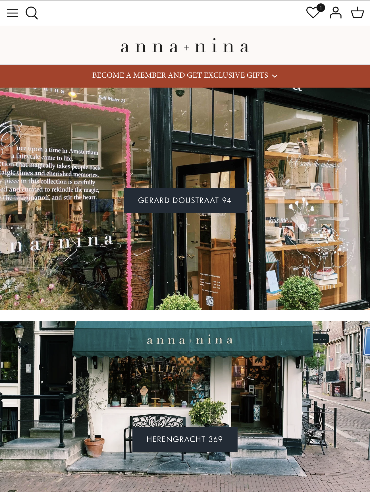
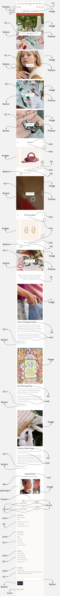
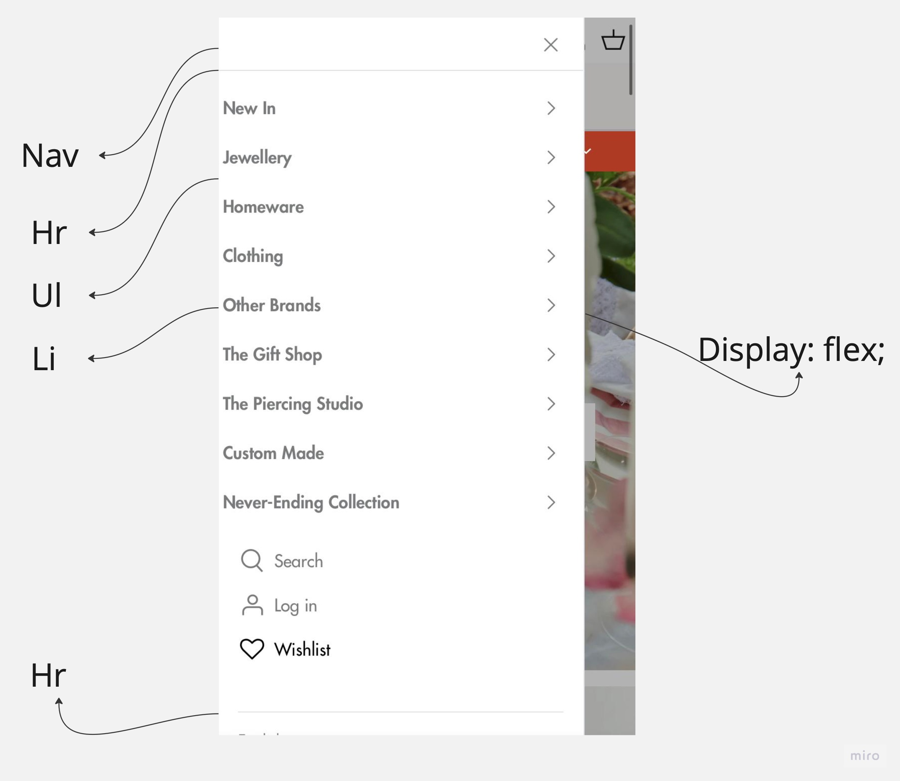
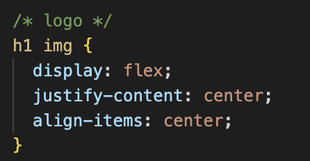

# Procesverslag
Markdown is een simpele manier om HTML te schrijven.  
Markdown cheat cheet: [Hulp bij het schrijven van Markdown](https://github.com/adam-p/markdown-here/wiki/Markdown-Cheatsheet).

Nb. De standaardstructuur en de spartaanse opmaak van de README.md zijn helemaal prima. Het gaat om de inhoud van je procesverslag. Besteedt de tijd voor pracht en praal aan je website.

Nb. Door *open* toe te voegen aan een *details* element kun je deze standaard open zetten. Fijn om dat steeds voor de relevante stuk(ken) te doen.

## Jij

  
uitwerken voor kick-off werkgroep

  ### Auteur:
  Stella Poort

  #### Je startniveau:
  hier je startniveau <strong>blauw</strong>

  #### Je focus:
  details
 

## Je website

  
uitwerken voor kick-off werkgroep

  ### Je opdracht:
  link naar de website die je gaat namaken óf de naam/omschrijving van je eigen ontwerp
  <h2>ANNA + NINA</h2>
  
https://www.anna-nina.nl

  #### Screenshot(s) van de eerste pagina (small screen): 
  Home pagina
  

  #### Screenshot(s) van de tweede pagina (small screen):
  Our stores pagina
  
 

## Toegankelijkheidstest 1/2 (week 1)

  
uitwerken na test in 2e werkgroep

  ### Bevindingen
 Lijst met je bevindingen die in de test naar voren kwamen:

 - 86 fouten gevalideerd.
 - Er word niet voor alt tekst toe gepast. 
 - Ze gebruiken voor zowat alles div's.
 - Niet kunnen scrollen al je het scherm verticaal houdt, omdat de navigatie balk meer dan de helft van het scherm overneemt.
 - Je kan duidelijk tabben door de website.
 - Maar je moet wel door veel onnodige dingen tabben voordat je bij de content komt.
 - Er zijn geen video's maar gif's die automatisch afspelen en niet gepauseerd kunnen worden.
 - Er is geen dark en light mode.
 - Er wordt Css in de HTML geschreven.
 - Bij de map word geen alt tekst gezet.
 

## Breakdownschets (week 1)

  
uitwerken na afloop 3e werkgroep

  ### de hele pagina: 
  

  ### dynamisch deel (bijv menu): 
  

  ### wellicht nog een dynamisch deel (bijv filter): 
  

## Voortgang 1 (week 2)

  
uitwerken voor 1e voortgang

  ### Stand van zaken
  hier dit ging goed & dit was lastig (neem ook screenshots op van delen van je website en code)

  <h2> Dit was nog niet goed</h2>
  

  ### Agenda voor meeting
  samen met je groepje opstellen

  | student 1 (ik) | student 2          | student 3    | student 4        |
  | ---            | ---                | ---          | ---              |
  | flexbox        | Javascript         | styling      | Ze had nog niks  |
  | html en css    |                    |              |                  |
  | controleren    |                    |              |                  |

  ### Verslag van meeting
  hier na afloop snel de uitkomsten van de meeting vastleggen

  - punt 1: logo in het midden krijgen
  - punt 2: Logo in H1 zetten
  - Punt 3: hr weghalen en border op de nav zetten
  - Punt 4: alle linkjes naar de andere pagina linken
  - Punt 5: main toevoegen
  - Punt 6: sections toevoegen
  - punt 7: Harder werken

## Voortgang 2 (week 3)

  
uitwerken voor 2e voortgang

  ### Stand van zaken
  hier dit ging goed & dit was lastig (neem ook screenshots op van delen van je website en code)

<h2>Niet nog goed ging:</h2>
   <ul>
        <li>hamburger menu</li>
        <li>navigatie balk</li>
        <li>buttons</li>
        <li>section voor de plaatjes</li>

      </ul>

  ### Agenda voor meeting
  samen met je groepje opstellen

  | student 1 (ik) | student 2          | student 3    | student 4        |
  | ---            | ---                | ---          | ---              |
  | Hamburger menu | Hamburger menu     | Menu         | Gedownloade font |
  |                | Responsive         |              | op de website    |
  |                | Grid               |              |                  |

  ### Verslag van meeting
  hier na afloop snel de uitkomsten van de meeting vastleggen

  - Punt 1: alle buttons een link maken
  - Punt 2: Css stuctureren
  - Punt 3: Hamburger menu oefenen

## Toegankelijkheidstest 2/2 (week 4)

  
uitwerken na test in 9e werkgroep

  ### Bevindingen
  Lijst met je bevindingen die in de test naar voren kwamen (geef ook aan wat er verbeterd is):
  
- Tab moet nog verbeterd wordden hij slaat nu veel elementen over.
- Als je je schem schuin houdt schaalt de website nog niet mee.
- De website is nog niet responsive.
- Ik heb wel verbeterd dat de dag en nachtmodus is toegevoegd.
- Alle images hebben een alt attribute.
- Ik heb wel bij de map een alt tekst gebruikt.
- Nog geen :focus state. 
- Je kan de gif niet pauseren.

## Voortgang 3 (week 4)

  
uitwerken voor 3e voortgang

  ### Stand van zaken
  hier dit ging goed & dit was lastig (neem ook screenshots op van delen van je website en code)

<h2>Niet nog goed ging:</h2>
   <ul>
        <li>navigatie balk</li>
        <li> hartjes op afbeelding zetten<li>

  ### Agenda voor meeting
  samen met je groepje opstellen

  | student 1 (ik) | student 2          | student 3    | student 4        |
  | ---            | ---                | ---          | ---              |
  | section images |                    |              |                  |
  | tot de rand van       |                    |              |                  |
  | scherm         | ...                | ...          | ...              |
  | Nav list smooth|
  | laten uitklappen|
 
  ### Verslag van meeting
  hier na afloop snel de uitkomsten van de meeting vastleggen

  - punt 1: Om de images tot de rand te laten lopen moet de margin op 0
  - punt 2: De nav list smooth te laten verschijnen moet je eerst translateX en dan een transition erop zetten.
  - punt 3: De night en day mode erop zetten
  - punt 4: meer micro interacties 

## Eindgesprek (week 5)

  
uitwerken voor eindgesprek

  ### Je uitkomst - karakteristiek screenshots:
  

  ### Dit ging goed/Heb ik geleerd: 
  Hamburger menu maken.

  

  ### Dit was lastig/Is niet gelukt:
  Responsive maken.

  

## Bronnenlijst

  
continu bijhouden terwijl je werkt

  Nb. Wees specifiek ('css-tricks' als bron is bijv. niet specifiek genoeg). 
  Nb. ChatGpT en andere AI horen er ook bij.
  Nb. Vermeld de bronnen ook in je code.

  1. bron 1: ChatGpt 
  2. bron 2: Studenten assistenten
  3. bron 3: oude code van vorig jaar (programmeren)
  4. bron 4: oude code van vorig jaar (internetstandaarden)
  5. bron 5: lesopdrachten
  6. bron 6: afbeeldingen van <a href="https://www.anna-nina.nl" >
  7. bron 7: icoontjes van <a href="https://icons8.com" >
  8. bron 8: Map van google maps
  9. bron 9: Mede studenten
  10. bron 10: https://codepen.io/shooft/pen/BarqGKx 
  11. bron 11: https://codepen.io/argyleink/pen/LYEegOO 

